# 🚀 GoMatch – Your Smart Ride Companion

  

GoMatch is a **Flutter-based ride-hailing app** designed for both **passengers and drivers**, enabling seamless ride bookings, vehicle registration, real-time tracking, and secure payments. Integrated with **Google Maps, Firebase, and Provider**, GoMatch ensures a smooth and efficient experience.

---

## 📌 Features at a Glance

### 🏡 **Home Screen**
✔ **Google Maps Integration** – Displays maps in real-time  
✔ **Route Mapping** – View ride routes dynamically  
✔ **Markers & Directions API** – Visual aids for better navigation  
✔ **State Management** – Efficient handling with Provider  

---

## 🚖 **Passenger Mode**
✔ **Ride Request System** – Enter locations and find nearby drivers  
✔ **Driver Selection** – Choose from available drivers  
✔ **Ride Acceptance** – Driver has 3 minutes to accept/reject (via Firebase)  
✔ **Seat Selection** – Choose preferred seat before payment  
✔ **Payments Screen** – Secure and seamless transactions  

---

## 🚘 **Driver Mode**
✔ **Driver Dashboard** – Manage ride requests and accept/reject rides  
✔ **Vehicle Registration** – Add vehicle details  
✔ **Stop Timings** – Set and manage stop timings  

---

## 🔐 **Authentication & Admin Panel**
✔ **Login & Signup Screens** – Secure authentication system  
✔ **Forgot Password Functionality** – Password recovery  
✔ **Admin Panel** – Monitor and manage drivers, stops, and ride data  

---

## 📸 **Screenshots**

### **🚀 Splash Screens**
| Splash 1 | Splash 2 | Splash 3 |
|----------|----------|----------|
| 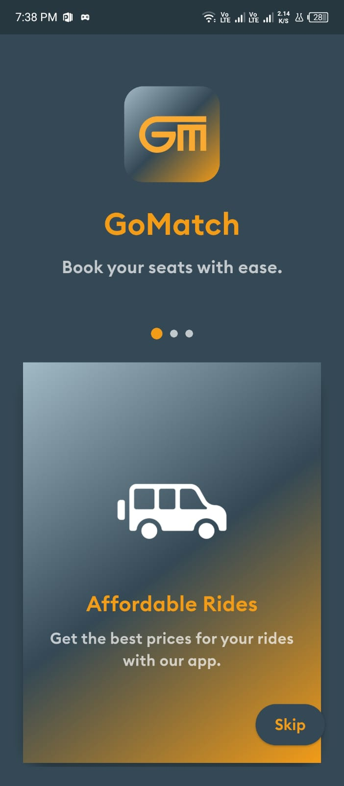 | 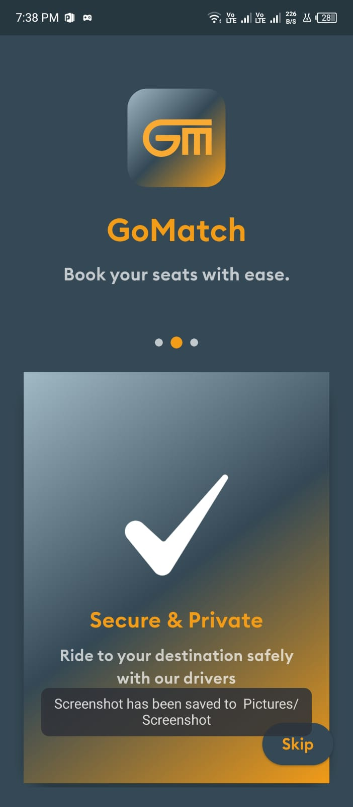 | 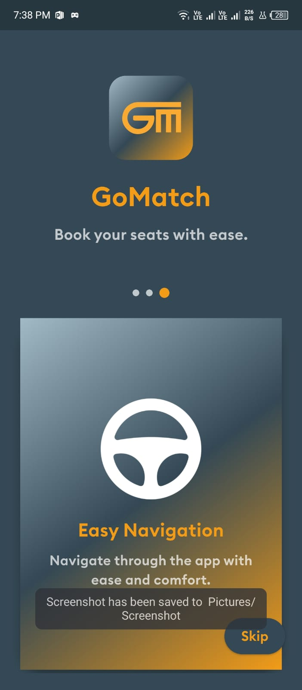 |

### **🚖 Passenger Mode**
| Home | Ride Request | Seat Selection | Payment |
|------|-------------|---------------|---------|
| 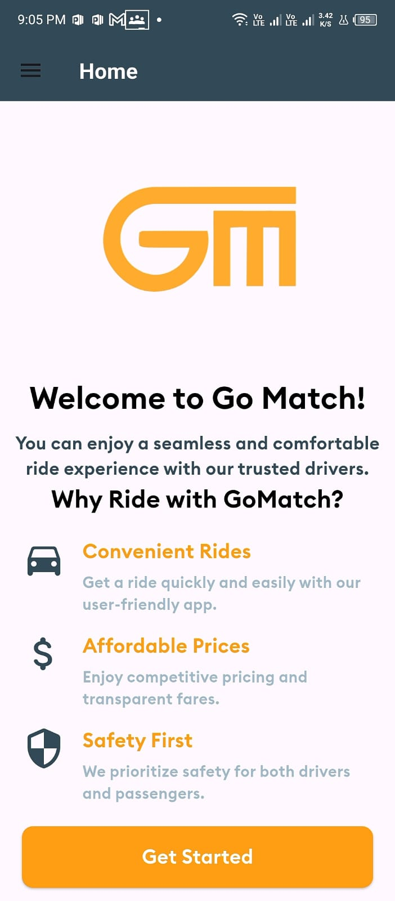 | 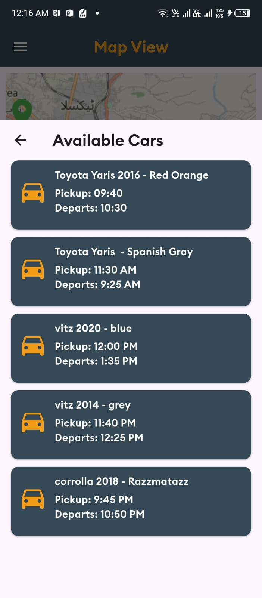 | 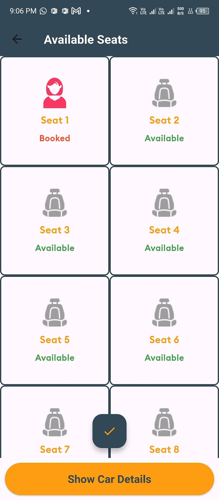 | 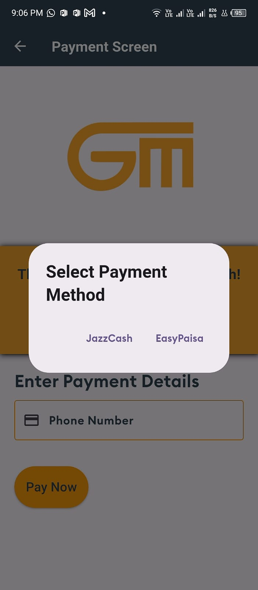 |

### **🚘 Driver Mode**
| Dashboard | Registration | Stops | Ride Requests | Seats View |
|-----------|--------------|-------|---------------|------------|
| 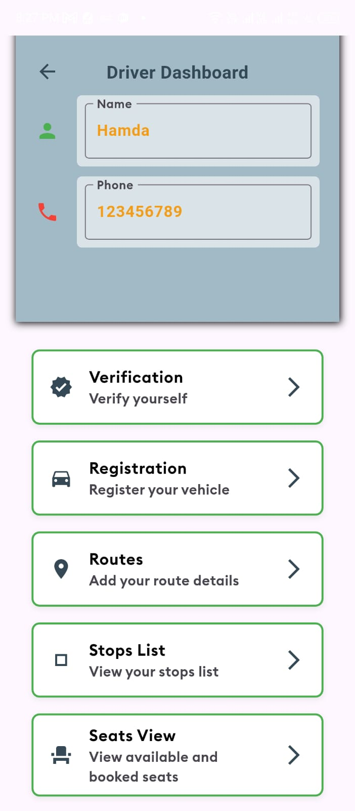 | 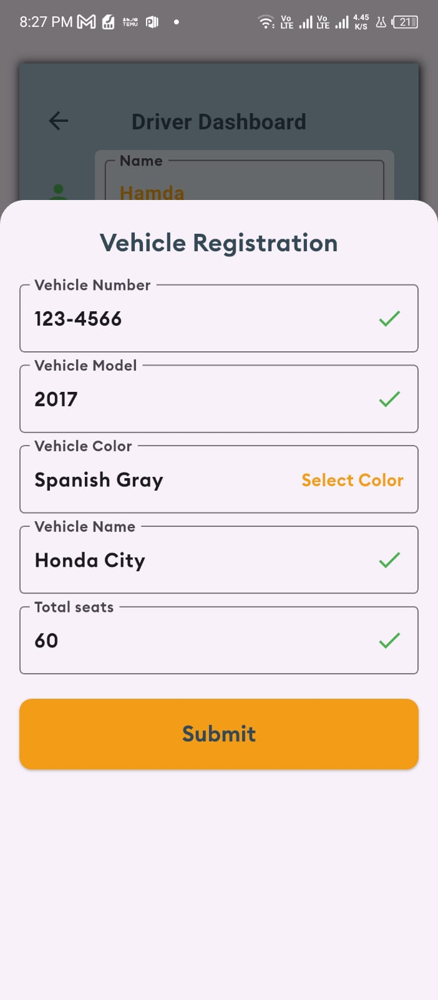 | 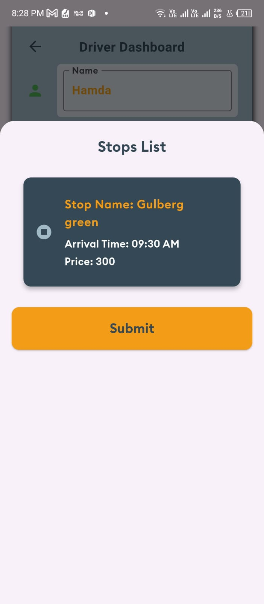 | 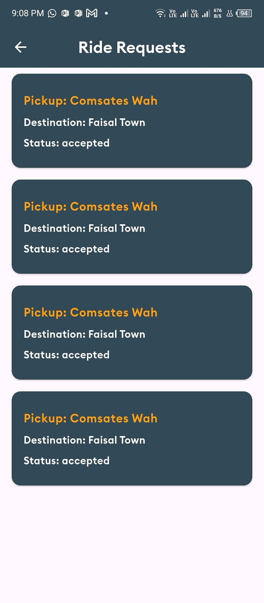 | 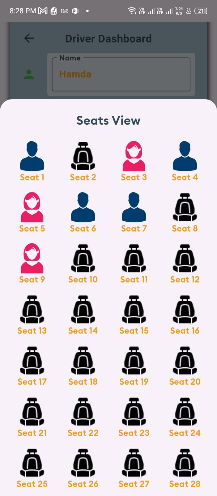 |


### **🔐 Authentication & Admin Panel**
| Login | Signup | Drivers | Passengers |
|-------|--------|---------|------------|
| 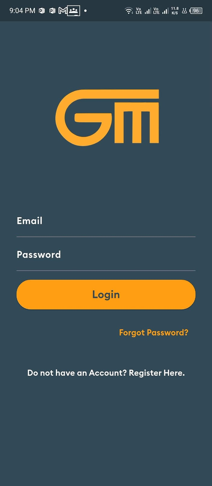 | 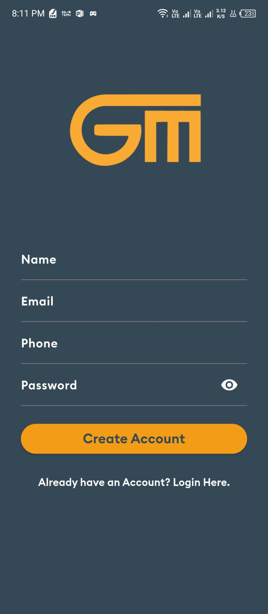 | 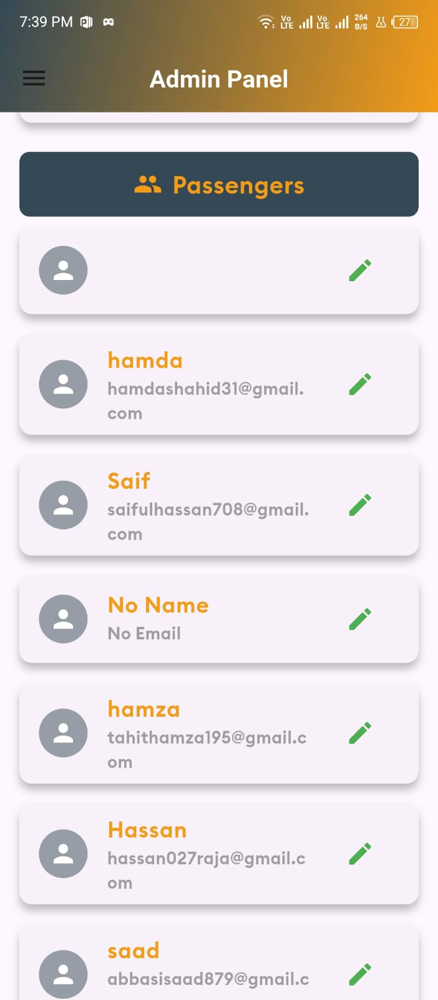 | 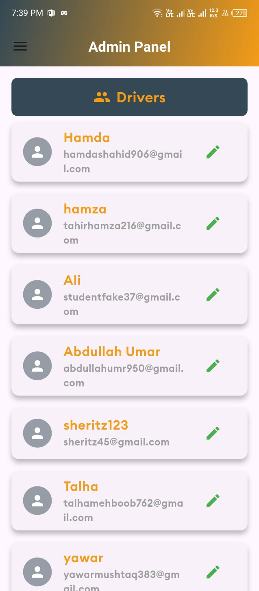 |

---

## 🚀 Upcoming Features
📱 **Final Testing & Deployment** – Optimizing for production  
🗺 **Real-Time Route Optimization** – Better route suggestions  
💳 **Multiple Payment Gateways** – More payment options  

---

## 🛠 **Installation & Setup**

### 📌 **Prerequisites**
✔ Install [Flutter](https://flutter.dev/docs/get-started/install)  
✔ Install [Dart](https://dart.dev/get-dart)  
✔ Install [Firebase CLI](https://firebase.google.com/docs/cli)  

### 📥 **Clone the Repository**
```sh
git clone https://github.com/hamdashahid/GoMatch.git
cd GoMatch
```

### 🚀 **Run the App**
1. **Install dependencies**:
    ```sh
    flutter pub get
    ```
2. **Configure Firebase**:
    - Follow the instructions to set up Firebase for both Android and iOS [here](https://firebase.flutter.dev/docs/overview).
3. **Run the app**:
    ```sh
    flutter run
    ```

---

## 📜 **License & Copyright**
© 2024 GoMatch. All rights reserved.

---

## 👨‍💻 Developer
**Hamda Shahid**
