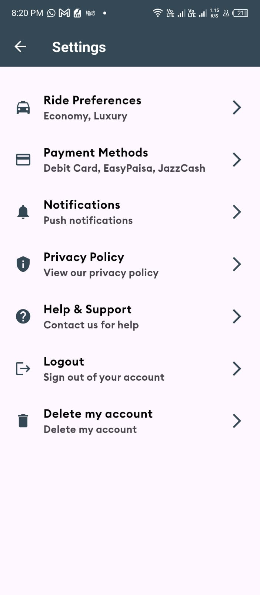

# 🚀 GoMatch – Your Smart Ride Companion

GoMatch is a **Flutter-based ride-hailing app** designed for both **passengers and drivers**, enabling seamless ride bookings, vehicle registration, real-time tracking, and secure payments. Integrated with **Google Maps, Firebase, and Provider**, GoMatch ensures a smooth and efficient experience.

---

## 📌 Features at a Glance

### 🏡 **Home Screen**

✔ **Google Maps Integration** – Displays maps in real-time  
✔ **Live Vehicle Tracking** – Shows nearby drivers  
✔ **Route Mapping** – View ride routes dynamically  
✔ **Search Autocomplete** – Predicts drop-off locations  
✔ **Markers & Directions API** – Visual aids for better navigation  
✔ **State Management** – Efficient handling with Provider

---

## 🚖 **Passenger Mode**

✔ **Ride Request System** – Enter locations and find nearby drivers  
✔ **Driver Selection** – Choose from available drivers  
✔ **Ride Acceptance** – Driver has 3 minutes to accept/reject (via Firebase)  
✔ **Seat Selection** – Choose preferred seat before payment  
✔ **Payments Screen** – Secure and seamless transactions

---

## 🚘 **Driver Mode**

✔ **Driver Dashboard** – Manage ride requests and accept/reject rides  
✔ **Vehicle Registration** – Add vehicle details  
✔ **Stop Timings** – Set and manage stop timings  
✔ **Driver Listings** – View and manage all registered drivers

---

## 🔐 **Authentication & Admin Panel**

✔ **Login & Signup Screens** – Secure authentication system  
✔ **Forgot Password Functionality** – Password recovery  
✔ **Admin Panel** – Monitor and manage drivers, stops, and ride data

---

## 📸 **Screenshots**

### **🚀 Splash Screens**

| Splash Screen 1                     | Splash Screen 2                     | Splash Screen 3                     |
| ----------------------------------- | ----------------------------------- | ----------------------------------- |
|  |  |  |

### **🚖 Passenger Mode**

| Home Screen                   | Ride Request                          | Seat Selection                          | Payment                             |
| ----------------------------- | ------------------------------------- | --------------------------------------- | ----------------------------------- |
|  |  |  |  |

### **🚘 Driver Mode**

| Driver Dashboard                               | Vehicle Registration                                  | Stop Timings                                  | Ride Requests                                          |
| ---------------------------------------------- | ----------------------------------------------------- | --------------------------------------------- | ------------------------------------------------------ |
|  |  |  |  |

### **🔐 Authentication & Admin Panel**

| Login                           | Signup                            | Drivers Shown                             | Passengers Shown                                |
| ------------------------------- | --------------------------------- | ----------------------------------------- | ----------------------------------------------- |
|  |  |  |  |

### **⚙️ Settings Page**

| Settings Overview                                       |
| ------------------------------------------------------- |
|  |

> **Note:** Screenshots are from the latest build of the app.

---

## 🚀 Upcoming Feature

📱 **Final Testing & Deployment** – Optimizing for production

---

## 🛠 **Installation & Setup**

### 📌 **Prerequisites**

✔ Install [Flutter](https://flutter.dev/docs/get-started/install)  
✔ Install [Dart](https://dart.dev/get-dart)  
✔ Install [Firebase CLI](https://firebase.google.com/docs/cli)

### 📥 **Clone the Repository**

```sh
git clone https://github.com/hamdashahid/GoMatch.git
cd GoMatch
```

### 🚀 **Run the App**

1. **Install dependencies**:
   ```sh
   flutter pub get
   ```
2. **Configure Firebase**:
   - Follow the instructions to set up Firebase for both Android and iOS [here](https://firebase.flutter.dev/docs/overview).
3. **Run the app**:
   ```sh
   flutter run
   ```

## 📜 **Copyright**

© 2024 GoMatch. All rights reserved.
